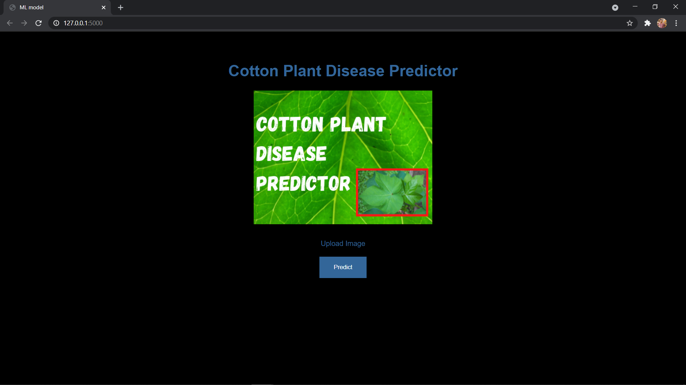
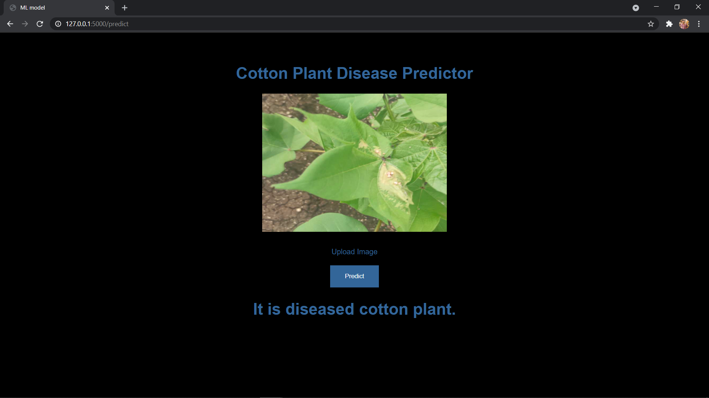
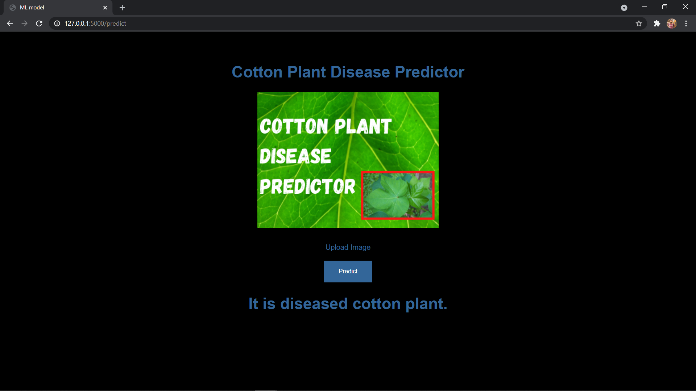

# Cotton-Disease-Prediction

  

Download Dataset From Here-->https://cottondiseasepredictorcnn.herokuapp.com/
• This repository consists of files required to Build a ___Cotton-Disease-Prediction Web App___ created with ___Flask___ deployed on ___Heroku___ platform.

• click on the following link to view the application : 
Deployed at: _https://diabetespredictionkaggle.herokuapp.com/_

_**----- WebApp -----**_ 

